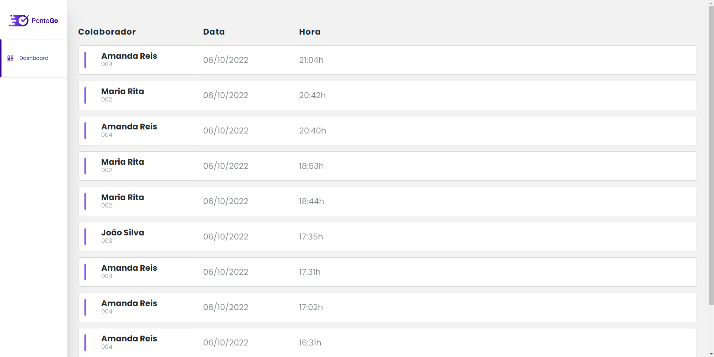
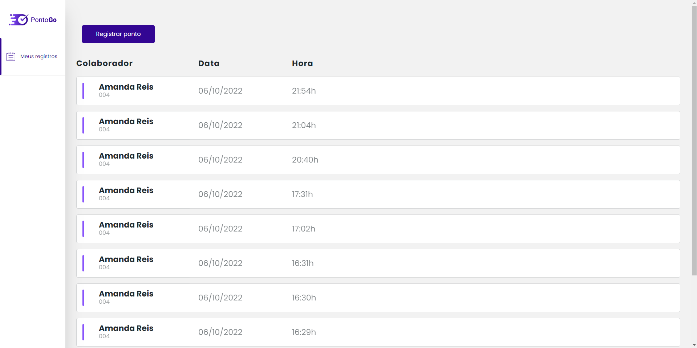
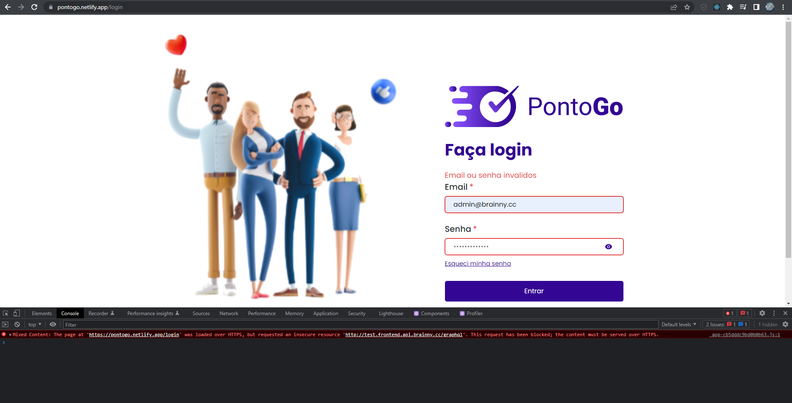
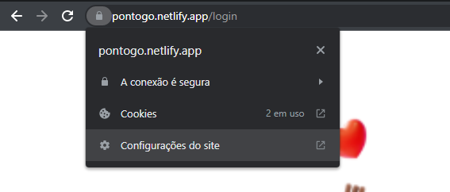
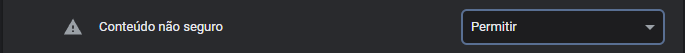
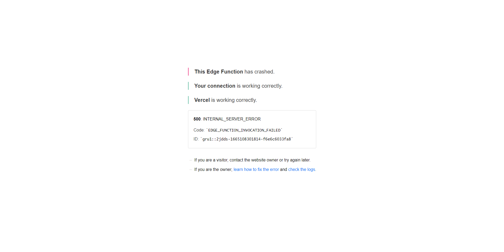

<h1 align='center'>PontoGo</h1>

# Bem vindo! 

#### PontoGo é um sistema de registro de pontos, onde colaboradores podem gerenciar seus pontos de forma simplificada!

## Iniciando

Primeiramente instale as dependências e inicie o servidor de desenvolvimento:

*Pela aplicação usar Next talvez seja preciso instalar o [Node](https://nodejs.org/en/) em sua maquina

```bash
npm install => npm run dev
# ou
yarn install => yarn dev
```

Abra [localhost:3000](http://localhost:3000) no browser e veja o resultado.

---

## Home "/"


Landing page com as principais informações da plataforma, incluindo os diferentes planos disponiveis.

## Login "/login"


Página  de login onde o (administrador ou colaborador) faz autenticação, e é redirecionado a seu respectivo painel dependendo de sua role.

## Dashboard "/dashboard"



Painel onde administradores conseguem verificar o registro de pontos dos colaboradores. Só pode ser acessado por usuários com a role "admin". 

## Meus registros "/meus-registros"



Painel onde colaboradores autenticados podem ver seus respectivos registros de pontos e realizar o registro de seus pontos diariamente. Só pode ser acessado por colaboradores com a role "user".

---

## Deploy (Netlify e Vercel)

[Netlify | pontogo.netlify.app/](https://pontogo.netlify.app/)

[Vercel | pontogo.vercel.app/](https://pontogo.vercel.app/) 

### Netlify

Por estar sob um https e fazer a requisição para um http (api graphql) a requisição é bloqueada e a autenticação é interrompida resultando em um email ou senha invalidos pelo lado do cliente.



A maneira que eu encontrei de contornar essa situação é ir nas configurações do site e permitir conteúdo não seguro, assim o fluxo ocorre normalmente.




### Vercel

O deploy na Vercel por outro lado, por algum erro relacionado a query do Apollo existente no middleware/SSR, retorna o erro "\__DEV__ is not defined" nas functions "crashando" a aplicação.



Como esse erro não é reproduzido no deploy da Netlify, presumo que ele parta da Vercel, sendo assim irei executar testes em outros ambientes para determinar as causas e assim que possivel irei abrir uma issue na Vercel em busca de uma solução.

---

## Tecnologias

> [React](https://reactjs.org/) - Biblioteca javascript para criação de interfaces.

> [Next.js](https://nextjs.org/) - Framework React, com Roteamento, Pre-rendering (SSR e SSG) e API Routes.

> [Apollo Client](https://www.apollographql.com/docs/react/) - Biblioteca Javascript para gerenciamento de queries usando GraphQL.

> [Chakra UI](https://chakra-ui.com/) - Biblioteca de UI que fornece componentes prontos para React.

> [Nookies](https://github.com/maticzav/nookies) - Helpers de gerenciamento de cookies para Next.js.

> [React Icons](https://react-icons.github.io/react-icons/) - Lib de icones para React.

> [React-Stacked-Center-Carousel](https://botdanny.github.io/react-stacked-center-carousel/#/) - Carrosel responsivo com center mode.

> [GraphQl Codegen](https://www.the-guild.dev/graphql/codegen/docs/getting-started) - Gerador de queries automatico. 

---


